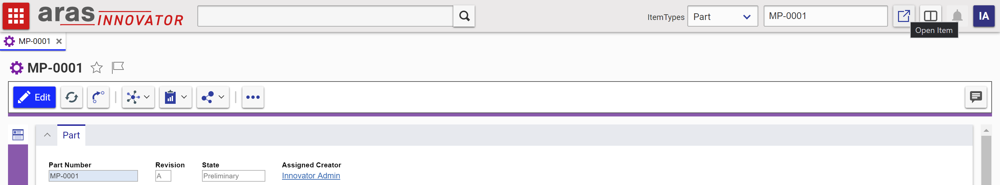

# Quick Open Item

This package adds several fields to the toolbar of the main screen that allow the user to quickly open an item if they know the keyed name of that item. 

## History

Release | Notes
--------|--------
[v1.0.0](https://github.com/ArasLabs/quick-open-item/releases/tag/v1.0.0) | Initial Release

#### Supported Aras Versions
Project | Aras
--------|--------
[v1.0.0](https://github.com/ArasLabs/quick-open-item/releases/tag/v1.0.0) | 12.0 SP1, 12.0 SP4

## Installation

#### Important!
**Always back up your code tree and database before applying an import package or code tree patch!**

### Pre-requisites

1. Aras Innovator installed (version 12.0 SPx preferred)
2. Aras Package Import tool
3. AF_QuickOpen import package

### Install Steps

#### Database Installation
1. Backup your database and store the BAK file in a safe place.
2. Open up the Aras Package Import tool.
3. Enter your login credentials and click **Login**
  * _Note: You must login as root for the package import to succeed!_
4. Enter the package name in the TargetRelease field.
  * Optional: Enter a description in the Description field.
5. Enter the path to your local `..\AF_QuickOpen\Import\imports.mf` file in the Manifest File field.
6. Select **AF_QuickOpen** in the Available for Import field.
7. Select Type = **Merge** and Mode = **Thorough Mode**.
8. Click **Import** in the top left corner.
9. Close the Aras Package Import tool.

You are now ready to login to Aras and try out the Quick Open functionality.

## Usage

1. Log in to Aras as admin.
2. In the toolbar at the top, select Part in the dropdown.
3. Enter in the Item Number of a Part in your database.
4. Click the open button.
5. Confirm that the Part with the given Item Number opens in a new tab.

## Contributing

1. Fork it!
2. Create your feature branch: `git checkout -b my-new-feature`
3. Commit your changes: `git commit -am 'Add some feature'`
4. Push to the branch: `git push origin my-new-feature`
5. Submit a pull request

For more information on contributing to this project, another Aras Labs project, or any Aras Community project, shoot us an email at araslabs@aras.com.

## Credits

Original Aras community project written by Taha Elhariri at Aras Corp.

Documented and published by Chris Gillis for Aras Labs. @cgillis-aras

## License

Aras Labs projects are published to Github under the MIT license. See the [LICENSE file](./LICENSE) for license rights and limitations.